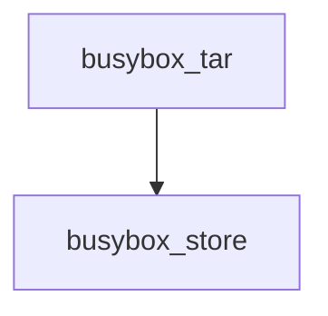
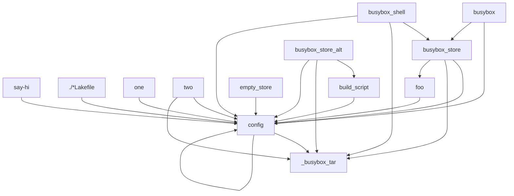

<h1>Lake</h1>

- [Overview](#overview)
  - [Syntax and Structure](#syntax-and-structure)
- [Basic Example of Functionality](#basic-example-of-functionality)
- [Stories](#stories)
  - [Use a target as a command](#use-a-target-as-a-command)
  - [Generate a file using echo](#generate-a-file-using-echo)
  - [Lakefile namespace is shared across files in a directory](#lakefile-namespace-is-shared-across-files-in-a-directory)
  - [Lakefile config sets the default shell](#lakefile-config-sets-the-default-shell)
  - [Download a file and use it as an executable](#download-a-file-and-use-it-as-an-executable)
  - [Build downloaded files and output their results](#build-downloaded-files-and-output-their-results)
  - [Import from another Lakefile](#import-from-another-lakefile)
  - [Use a target/command as an input to a store and reference it within the build script](#use-a-targetcommand-as-an-input-to-a-store-and-reference-it-within-the-build-script)
  - [Generate a directory](#generate-a-directory)
  - [Use a glob pattern or directory as an input](#use-a-glob-pattern-or-directory-as-an-input)
  - [Use a negative glob pattern to exclude files?](#use-a-negative-glob-pattern-to-exclude-files)
  - [Use the network](#use-the-network)
  - [Use a cache directory](#use-a-cache-directory)
- [Internals](#internals)
  - [Simple parse and build example](#simple-parse-and-build-example)
  - [Imports and product structure](#imports-and-product-structure)

## Overview

Lake is a build system that intends to provide hermetic, reproducible builds across many languages, operating systems and architectures.


### Syntax and Structure

Lake builds are defined using files named `Lakefile` or with
the extension `.Lakefile`. A directory containing lakefiles represents a single
package. A namespace is shared across files within a directory (like
Go/terraform).

Each lakefile specifies `target` recipes and `store` recipes.

A `store` is a library or program that is built and stored in the central build
store. It can then be referenced in another `store` or `target`.

A `target` is a file/directory that will be generated, or it is a command that
can be invoked from within the directory it is specified. If a target name
starts with a relative path `./` it is considered to be a file. If it doesn't, it
is a command.

`store` and `target` recipes have `inputs`. When a target command is executed
all `inputs` are assembled and any necessary dependencies are built in order.

Rough notes on some goals and features:
- Hcl config syntax
- "pure", only uses executables and libraries through external dependencies
- Write scripts to generate files
- Write scripts to add files to a "store"
- File generation a first class pattern (like make)
- Build docker images
- Allow mounting of a cache directory within a store build
- Compile a Go program and pull dependencies without the network
- Store dependencies and hashes/lock data
- Import other lake files and manage many lake files in many folders within one project
- Building across different platforms

## Basic Example of Functionality

./busybox/script.sh

```sh
# Lists all programs supported by the busybox binary and creates symlinks for
# each program in the $out/bin folder
set -e
$busybox_tar/busybox-x86_64 mkdir $out/bin
$busybox_tar/busybox-x86_64 cp $busybox_tar/busybox-x86_64 $out/bin/busybox
cd $out/bin
for command in $(./busybox --list); do
    ./busybox ln -s busybox $command
done
```

./busybox/Lakefile

```hcl
# builtin that downloads the file
store "busybox_tar" {
  env = {
    fetch_url = "true"
    url = "http://lake.com/busybox.tar.gz"
  }
  network = true
}

# Set the default shell to be the file that's in the download
config {
  shell = ["${busybox_tar}/busybox-x86_64", "sh"]
}

# Uses script.sh to build a store
store "busybox_store" {
  inputs = [busybox_tar, "./script.sh"]
  script = "sh ./script.sh"
}

# Surface an "ls" command using busybox
# Invoke with `lake ls ../`
target "ls" {
  inputs = [busybox_store]
  script = <<EOH
    $busybox_store/bin/ls $@
  EOH
}

target "busybox" {
  inputs = [busybox_store]
  script = "$busybox_store/bin/busybox $@"
}

shell = ["${busybox_store}/bin/sh"]
```


./Lakefile

```hcl
import "github.com/maxmcd/lake/lib/busybox" {}

config { shell = busybox.shell }

target "say_hello" {
  script = <<EOH
    echo "hello $1"
  EOH
}

target "./one.txt" {
  script = <<EOH
    echo 1 > ./one.txt
  EOH
}
```

```bash
$ lake say_hello max
hello max
$ lake ./one.txt
$ cat ./one.txt
1
```


## Stories

A collection of user stories that describe functionality Lake expects to support.

### Use a target as a command

```hcl
target "ls" {
  inputs = [busybox_store]
  script = <<EOH
    $busybox_store/bin/ls $@
  EOH
}
```

This can then be run like so:
```bash
$ lake ls -lah ./lib
total 0
drwxr-xr-x   3 max  staff    96B Nov 26 22:34 .
drwxr-xr-x  15 max  staff   480B Nov 26 22:22 ..
drwxr-xr-x   3 max  staff    96B Nov 26 22:34 busybox
```

Behind the scenes this (might):

1. Take the target and write it to a file in the store (like `.../store/a7sdfas78df.script`).
2. When `lake ls` is invoked, run an `exec` with the provided shell/interpreter and the script passed as the first argument. (do we pass args correctly?)
3. The script file is located in the store, but the command is executed from the position of the `lake` invocation.

We can also use target commands in another recipe:

```hcl
target "./this_file" {
  inputs = [ls]
  script = <<EOH
    ${ls} -lah > this_file
  EOH
}
```
In this situation we must provide a single-string value to replace `${ls}` with so that when it is invoked it executes the expected command within the correct context.

Do we create another file in the `.../store` with all of the expected environment variables loaded up? Maybe something like this:

```bash
export busybox_store="../store/asdfasdfasdfas/"
exec .../store/a7sdfas78df.script
```

But this doesn't work, because we can't assume the shell context is the same. So what is `${ls}` replaced with? Somewhat sensible might that is expands to `$interpreter $script_location`, but then how do we inject the necessary environment variables?

Do we inject a static executable `$hydrator $script-config` and then this thing runs an `exec` with the values included? Would be great to avoid injecting an executable. How else do we invoke `exec` in an environment-agnostic way?

### Generate a file using echo

```hcl
target "./bar.txt" {
  script = "echo 'bar' > ./bar.txt"
}
target "./foo.txt" {
  inputs = ["./bar.txt"]
  script = <<EOH
    car bar.txt > ./foo.txt
    echo "foo" >> ./foo.txt
  EOH
}
```

We run this in a separate environment when running. A folder is created like so:
`/tmp/build_location/`, any necessary source files are copied into the build folder.

When building `bar.txt` no source files are listed. We'll start the build in an empty directory like `/tmp/build_location/Ze7aef8aefaeta2que5ingeelohuich2`. Executables will be made available for the build (more on that later) and the script will be run.

Once that is built we can build `foo.txt`. A similar random folder is created but `./bar.txt` is copied into the build environment.


### Lakefile namespace is shared across files in a directory

**./download.Lakefile**

```hcl
# builtin that downloads the file
store "busybox_tar" {
  env = {
    fetch_url = "true"
    url = "http://lake.com/busybox.tar.gz"
  }
  network = true
}

# Set the default shell to be the file that's in the download
config {
  shell = ["${busybox_tar}/bin/busybox", "sh"]
}

```

**./foo.Lakefile**

```hcl
# Can reference busybox_tar from download.Lakefile
store "busybox_store" {
  inputs = [busybox_tar, "./script.sh"]
  script = "sh ./script.sh"
}
```


### Lakefile config sets the default shell


```hcl
config {
  shell = ["${busybox_tar}/bin/busybox", "sh"]
}

# This inherits the inputs and shell from the config
# TODO: inputs are detected? Hmm, is that a break from the norm?
target "say hi" { script = "echo hi" }

```

### Download a file and use it as an executable

```hcl
store "busybox_tar" {
  env = {
    fetch_url = "true"
    url = "http://lake.com/busybox.tar.gz"
  }
  network = true
}

# Uses script.sh to build a store
store "busybox_store" {
  inputs = [busybox_tar, "./script.sh"]
  script = "sh ./script.sh"
}
```

The store recipe with a `fetch_url` set to true and a `url` is a special store that will use the network to download a file.
Once downloaded, other recipes can then directly reference the the enclosed files.

### Build downloaded files and output their results

./busybox/script.sh

```sh
set -e
$busybox_tar/busybox-x86_64 mkdir $out/bin
$busybox_tar/busybox-x86_64 cp $busybox_tar/busybox-x86_64 $out/bin/busybox
cd $out/bin
for command in $(./busybox --list); do
    ./busybox ln -s busybox $command
done
```

./busybox/Lakefile

```hcl
store "busybox_tar" {
  env = {
    fetch_url = "true"
    url = "http://lake.com/busybox.tar.gz"
  }
  network = true
}

# Uses script.sh to build a store
store "busybox_store" {
  inputs = [busybox_tar, "./script.sh"]
  script = "sh ./script.sh"
}
```

Stores put their outputs in an $out directory. Alternatively file generation recipes just update the expected output at the expected location.

### Import from another Lakefile


**./foo/Lakefile**
```hcl
hello = "hello"

_no = "no"

target "./foo" {}
```

**./bar/Lakefile**
```hcl
import "github.com/maxmcd/lib/foo" {}

hello_max = "${foo.hello} max"

# These don't work, can't import underscore names or file targets
# error = foo._no
# error = foo../foo
```

**./baz/Lakefile**
```hcl
import "github.com/maxmcd/lib/foo" { alias = "thing" }

# Names cannot conflict with import names, use an alias
store "foo" {}

hello_max = "${thing.hello} max"
```

### Use a target/command as an input to a store and reference it within the build script

```hcl
target "ls" {
  inputs = [busybox_store]
  script = <<EOH
    $busybox_store/bin/ls $@
  EOH
}

target "./this_file" {
  inputs = [ls]
  script = <<EOH
    ${ls} -lah > this_file
  EOH
}
```

### Generate a directory

- If any sources have changed we re-generate the directory
- If the directory exists and sources have changed, but the directory contents have changed what do we do?
- Maybe generating directories is unwise, could lead to correctness ambiguity?
- Oh, or maybe we consider that the directory is owned by lake, if we rebuild we delete and re-create the contents?

```hcl
target "./this_dir" {
  inputs = [busybox]
  script = <<EOH
    mkdir ./this_dir
    touch ./this_dir/thing
  EOH
}
```

### Use a glob pattern or directory as an input

Bazel doesn't allow a directory to be specified by name unless a glob is used to
include files it contains. A glob will also only match files and no
sub-directories unless a `**` is used. . Should we do the same? The
`"./this_dir"` example below would be harder to inspect and know that it's
including many files.

```hcl
target "print_sha256sum_of_dir" {
  inputs = [busybox, "./this_dir"]
  script = <<EOH
    tar ./this_dir - | sha256sum
  EOH
}
```
or
```hcl
target "print_sha256sum_of_dir" {
  inputs = [busybox, "./this_dir/*"]
  script = <<EOH
    tar ./this_dir - | sha256sum
  EOH
}
```
or
```hcl
target "print_sha256sum_of_dir" {
  inputs = [busybox, "./this_dir/**"]
  script = <<EOH
    tar ./this_dir - | sha256sum
  EOH
}
```


### Use a negative glob pattern to exclude files?

```hcl
store "something" {
  inputs = [busybox, "./this_dir/**", "!./this_dir/readme.md"]
}
```

To allow very specific specification of source files we could use a negative
match to exclude specific files.

### Use the network

By default the network is disabled in `store` recipes. The network can be
enabled with the `network` attribute. Built-in "fetchers" will be allowed to use
the network but will verify that the resource being requested matches a hash
that is stored in a lock file. Use of the network outside of a fetcher should be
avoided and will introduce the possibility of breaking reproducibility.

```hcl
# A custom store
store "something" {
  inputs = [busybox]
  network = true
}

# out fetch_url built-in
store "busybox_tar" {
  env     = { fetch_url = "true", url = "https://brmbl.s3.amazonaws.com/busybox-x86_64.tar.gz" }
  network = true
}
```

### Use a cache directory

```hcl
store "go_binary" {
  inputs = ["..."]
  env = {
    # This is simple enough, and it means its a value that can be passed
    # around. Do we end up stripping the cache dir from the input tho?
    CACHE_DIR = cache_directory()
  }
  script = <<EOH
    go build -o $out/bin/thing
  EOH
}
```


## Internals

### Simple parse and build example

Take our simple busybox example. How is this parsed and then built?

```hcl
store "busybox_tar" {
  env     = { fetch_url = "true", url = "https://brmbl.s3.amazonaws.com/busybox-x86_64.tar.gz" }
  network = true
}

store "busybox_store" {
  inputs = [busybox_tar, "./install.sh", ]
  shell  = ["${busybox_tar}/busybox-x86_64", "sh"]
  script = <<EOH
    ${busybox_tar}/busybox-x86_64 sh ./install.sh
  EOH
}
```

Parsing this file spits out the following json:

```json
{
  "busybox_store": {
    "Inputs": [
      "{{ 525zavu5llf5gyfyq73x5mys6mrs7vha }}",
      "./install.sh"
    ],
    "IsStore": true,
    "Name": "busybox_store",
    "Script": "    {{ 525zavu5llf5gyfyq73x5mys6mrs7vha }}/busybox-x86_64 sh ./install.sh\n",
    "Shell": [
      "{{ 525zavu5llf5gyfyq73x5mys6mrs7vha }}/busybox-x86_64",
      "sh"
    ]
  },
  "busybox_tar": {
    "Env": {
      "fetch_url": "true",
      "url": "https://brmbl.s3.amazonaws.com/busybox-x86_64.tar.gz"
    },
    "IsStore": true,
    "Name": "busybox_tar",
    "Network": true
  }
}
```

We get a map with two values, each representing one of our recipes. `busybox_tar` uses the `fetch_url` built-in. It has no inputs, no shell and no script. `busybox_store` uses files from `busybox_tar` in its execution. To track that reference you can see that we've replaced the `${busybox_tar}` argument with the value `{{ 525zavu5llf5gyfyq73x5mys6mrs7vha }}`. This value is a template value containing a hash of `busybox_tar`. We use these hashes to track references between difference recipes.

The dependency chain here is simple, first we build `busybox_tar` and then we can use the resulting values to build `busybox_store`.



### Imports and product structure

> **Scratch notes**
> - Need a sum file for download hashes
> - Otherwise we could use gopath-style dependency tree?
> - lake.hcl project file?
> - Dependencies are named and configured centrally? what about nearby directories?
> - No relative imports would be nice

Rough options:

1.
    Be like Go, use a GOPATH style source tree and expect manual dependency resolution at first with reproducible dependency resolution added later with a proxy service to help with version registration.

    Pros:
      -  Import paths are actually a name of a place where the thing can be found
      -  No relative paths anywhere
      -  Don't have to set up a hosted package registry (no dealing with related security or management either!)

    Cons:
      -  Major version structure is awkward/confusing
      -  Changing location of sub-packages within a single repo can lead to lots of undefined behavior
      -  The possibility of packages existing at multiple path depths creates complexity during resolution
      -  Unclear how to reference local packages
      -  Import names are long (necessitates tooling like goimports)


2. Be like rust/js, packages have names, they are registered in a central registry, they have versions, they can also be local paths and version control repositories (but no version resolution if they do!).

    Pros
     - People know how this works
     - Import names are short and intuitive (as long as relative import paths are disallowed)
     - Global namespace of names means communicating packages is crystal clear

    Cons
     - Ugh central control of names
     - Package security drama
     - Short names are good until fork/rename/split/refactor
     - Usually entirely unclear how code ended up in the package registry, can be pushed from private, can be different than version control


What if we have a `lake.hcl` that lists package names, but only points to version control repos?

**lake.hcl**

```hcl
name = "lake"
dependencies {
  boat    = "github.com/maxmcd/boat"
  boat_v2 = "github.com/maxmcd/boat@v2"
  swimmer = { thing = "github.com/maxmcd/swimmer", version = "3" }
  duck    = { path = "../" }
}
```

And then in the Lakefile, imports are just:

```hcl
import "lake/lib/busybox" {}
import "boat" {}
# or?
imports {
  busybox = "lake/lib/busybox"
  boat = "boat"
}
```

Pros:
- Import names are simple
- Versioning and package location complexity are handled in a single file
- Refactors and cloning repos are possible without replacing all import statements in package
- Still using file paths, don't need to figure out exporting a single "module"

Cons:
- Short ambiguous names
- not enough context in a single file example to execute code



